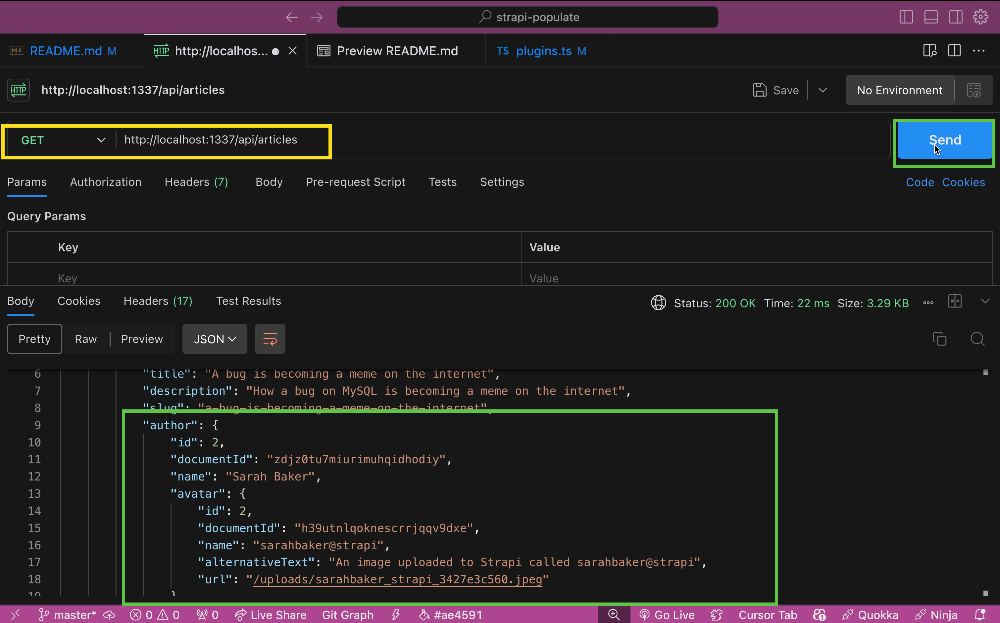

Managing data relationships in a headless CMS like Strapi can sometimes be challenging, especially when it comes to locking down access to certain items. 

The Strapi Protected Populate Plugin significantly simplifies handling complex data structures while ensuring data security. This blog post will explore how this plugin can streamline your workflow and enhance your Strapi experience.

## Why the Strapi Protected Populate Plugin Exists


Strapi provides a powerful headless CMS framework, by default, Strapi allows you to populate data relationships as deep as you want. 

While this flexibility can be useful, it also poses a significant risk of data leakage. Unrestricted population depth can inadvertently expose sensitive information to unauthorized users, especially in complex data structures. 

This is where the Strapi Protected Populate Plugin comes into play. The plugin was developed to address these challenges by providing a controlled and secure data population, ensuring that only authorized users can access specific data relationships.

## Key Features

**1. Data Security**

Data protection is crucial, especially when dealing with sensitive information. The Protected Populate Plugin ensures only authorized users can access specific data relationships. By implementing fine-grained access control, the plugin helps maintain data integrity and security. It is an ideal choice for applications that handle sensitive data.

**2. UI Based**

Thanks to its user-friendly interface, integrating the Protected Populate Plugin into your Strapi project is straightforward. The plugin is designed to work seamlessly with Strapi's existing architecture, ensuring that you can start using it with minimal configuration. This ease of integration means you can enhance your data management capabilities without significantly changing your existing codebase.

**3. Auto Populate**

One of Strapi's primary challenges is managing relationships between different data types. The [Protected Populate Plugin](https://market.strapi.io/plugins/strapi-plugin-protected-populate) addresses this by providing an intuitive way to automatically populate all the fields you have selected for a user to view if no specific query is provided. This feature alone can save developers significant time and effort, allowing them to focus on building features rather than managing data.

## Getting Started

To get started with the Protected Populate Plugin, you can follow these steps:

1. Setup your Strapi project.
2. Install the plugin from the Strapi Marketplace.
3. Configure the plugin to suit your project's needs.
4. Start using the plugin to manage your data relationships with confidence.

**1. Setup your Strapi project.**

We will set up an simple Strapi project with example data types and relationships.

Let's start by running this command to create a new Strapi project:

```bash
npx create-strapi-app@latest strapi-populate
```

You will be prompted to answer a few questions about your project.

We will skip signing up for Strapi Cloud.

Just make sure that you select `yes` for `Start with an example structure & data?`

```bash
npx create-strapi-app@latest

 Strapi   v5.9.0 🚀 Let's create your new project

? What is the name of your project? strapi-populate
? Do you want to use the default database (sqlite) ? Yes
? Start with an example structure & data? Yes
? Start with Typescript? Yes
? Install dependencies with npm? Yes
? Initialize a git repository? Yes

 Strapi   Creating a new application at /Users/paul/work/strapi-populate
```

Now that we have our project, you can start the Strapi server by running this command:

```bash
cd strapi-populate
npm run develop
```

You will be prompted to create an admin user.

Once you have created an admin user, you can login to the Strapi admin panel at [http://localhost:1337/admin](http://localhost:1337/admin).

**2. Install the plugin from the Strapi Marketplace.**

You can install the plugin from the Strapi Marketplace by running this command:

```bash
npm install strapi-plugin-protected-populate
```

Once the plugin is installed, we would need to configure it by adding the plugin to the `config/plugins.ts` file.

```ts
export default () => ({
  "protected-populate": {
    enabled: true,
  },
});
```

Nice now that we have the plugin enabled with the default configuration, we can start using it.

Let's see what we get out of the box before exploring additional configuration options.

## How To Use The Plugin

1. Open strapi
2. On the left side in the menu click on the lock icon
3. Now you should see the following


4. Click + Add a new protected route


**note:** notice that we are selecting `GET /api/articles` and matching it with the appropriate collection type `api::article.article`.

These need to match for the plugin to work.

Since our example data has `Article` collection type, that is what we are using.

Now that we have created a protected route, we can start using it.

If you want to enable to use the `users-permissions` plugin, you can check the checkbox. This will let you be more granular with your permissions.

I am going to skip that for now. And my permission will be set for both.

Go ahead and click `Save`.


Make sure that you **Articles** are published.


And you enable the endpoint in the `Settings -> Users & Permissions` tab.


Now that we have everything set up, let's see what we get in our response using **Postman**.

I am going to make a `GET` request to the `http://localhost:1337/api/articles?populate=*` endpoint with the populate flag. Notice, how it will be ignored, and we only see the `id` and `documentId` fields but all others are ignored.


Now, back in the Protected Populate Plugin, I am going to add the following fields to populate: `title`, `description`, `slug` and click `Save`.


Now, I am going to make a `GET` request to the `http://localhost:1337/api/articles?populate=*` endpoint with the populate flag. Notice, now we see the `title`, `description`, `slug` fields. And all other fields are ignored.


Nice, this is awesome. We can now lock down our data and only allow users to see the fields we want them to see. Even if they try to use the `populate` attribute in their request.

Now, that we have basic usage, let's see how we can use the the auto populate feature.

## Setting Up Auto Populate

**auto-populate**: will make the API return all selected fields you selected.

Let's update our configuration to enable the auto populate feature in the `config/plugins.ts` file.

for TS

```ts
export default () => {
  return {
    "protected-populate": {
      enabled: true,
      config: {
        ["auto-populate"]: true,
      },
    },
  };
};
```

for JS

```js
module.exports = () => {
  return {
    "protected-populate": {
      enabled: true,
      config: {
        ["auto-populate"]: true,
      },
    },
  };
};
```

Now, that we enabled this feature, back in the Protected Populate Plugin Admin we will ask to return the `author` field.

We will still need to enable the `users-permissions` plugin to be able to populate the `author` field.


Now, if we make a `GET` request to the `http://localhost:1337/api/articles` endpoint with the populate flag. Notice, now we see the `author` field.


But we don't see any of the data, because by default the Protected Populate will only return the fields that you will allow.

So let's update it to the following, we will allow `name` and `avatar` fields.

Avatar field will include the `name`, `alternativeText`, and `url` field.

The `url` field was of screen but I made sure to select it in the `avatar` dropdown.


Now, if we make a `GET` request to the `http://localhost:1337/api/articles` endpoint with the populate flag. Notice, now we see the `author` field.



Our full response only allow us to return the data that we allow.

```js
{
    "data": [
        {
            "id": 6,
            "documentId": "x92qf8togl3l5xnvcm6uxi42",
            "title": "A bug is becoming a meme on the internet",
            "description": "How a bug on MySQL is becoming a meme on the internet",
            "slug": "a-bug-is-becoming-a-meme-on-the-internet",
            "author": {
                "id": 2,
                "documentId": "zdjz0tu7miurimuhqidhodiy",
                "name": "Sarah Baker",
                "avatar": {
                    "id": 2,
                    "documentId": "h39utnlqoknescrrjqqv9dxe",
                    "name": "sarahbaker@strapi",
                    "alternativeText": "An image uploaded to Strapi called sarahbaker@strapi",
                    "url": "/uploads/sarahbaker_strapi_3427e3c560.jpeg"
                }
            }
        },
        {
            "id": 7,
            "documentId": "y8jayr7ymbey9j81n0z7tya1",
            "title": "Beautiful picture",
            "description": "Description of a beautiful picture",
            "slug": "beautiful-picture",
            "author": {
                "id": 2,
                "documentId": "zdjz0tu7miurimuhqidhodiy",
                "name": "Sarah Baker",
                "avatar": {
                    "id": 2,
                    "documentId": "h39utnlqoknescrrjqqv9dxe",
                    "name": "sarahbaker@strapi",
                    "alternativeText": "An image uploaded to Strapi called sarahbaker@strapi",
                    "url": "/uploads/sarahbaker_strapi_3427e3c560.jpeg"
                }
            }
        },
        {
            "id": 8,
            "documentId": "t7gp8jmzgq3ku4qlnhftat1s",
            "title": "The internet's Own boy",
            "description": "Follow the story of Aaron Swartz, the boy who could change the world",
            "slug": "the-internet-s-own-boy",
            "author": {
                "id": 1,
                "documentId": "i7qn2stvzcehvjh3bwoqck3h",
                "name": "David Doe",
                "avatar": {
                    "id": 1,
                    "documentId": "mnybhptzjgzqepzrj4tnde2g",
                    "name": "daviddoe@strapi",
                    "alternativeText": "An image uploaded to Strapi called daviddoe@strapi",
                    "url": "/uploads/daviddoe_strapi_ff8349070f.jpeg"
                }
            }
        },
        {
            "id": 9,
            "documentId": "nis5i7wl5h0snf581mq7oeao",
            "title": "This shrimp is awesome",
            "description": "Mantis shrimps, or stomatopods, are marine crustaceans of the order Stomatopoda.",
            "slug": "this-shrimp-is-awesome",
            "author": {
                "id": 1,
                "documentId": "i7qn2stvzcehvjh3bwoqck3h",
                "name": "David Doe",
                "avatar": {
                    "id": 1,
                    "documentId": "mnybhptzjgzqepzrj4tnde2g",
                    "name": "daviddoe@strapi",
                    "alternativeText": "An image uploaded to Strapi called daviddoe@strapi",
                    "url": "/uploads/daviddoe_strapi_ff8349070f.jpeg"
                }
            }
        },
        {
            "id": 10,
            "documentId": "hbh9x13v4yaj1qy5qn62qanz",
            "title": "What's inside a Black Hole",
            "description": "Maybe the answer is in this article, or not...",
            "slug": "what-s-inside-a-black-hole",
            "author": {
                "id": 2,
                "documentId": "zdjz0tu7miurimuhqidhodiy",
                "name": "Sarah Baker",
                "avatar": {
                    "id": 2,
                    "documentId": "h39utnlqoknescrrjqqv9dxe",
                    "name": "sarahbaker@strapi",
                    "alternativeText": "An image uploaded to Strapi called sarahbaker@strapi",
                    "url": "/uploads/sarahbaker_strapi_3427e3c560.jpeg"
                }
            }
        }
    ],
    "meta": {
        "pagination": {
            "page": 1,
            "pageSize": 25,
            "pageCount": 1,
            "total": 5
        }
    }
}
```

## Conclusion

The Strapi Protected Populate Plugin is a valuable addition to any Strapi project, offering simplified data population, enhanced security, and easy integration. 

Whether you are building an e-commerce platform, a content management system, or an educational application, this plugin can help streamline your data management processes and improve overall efficiency. Give it a try and see how it can make your life easier!

For more details and to contribute to the project, visit the [GitHub repository](https://github.com/strapi-community/strapi-plugin-protected-populate).

Project example code [GitHub repository](https://github.com/PaulBratslavsky/strapi-protected-populate-plugin-example).

## Strapi Open Office Hours
If you have any questions about Strapi 5 or just would like to stop by and say hi, you can join us at **Strapi's Discord Open Office Hours** Monday through Friday at 12:30 pm - 1:30 pm CST: [Strapi Discord Open Office Hours](https://discord.com/invite/strapi)

<cta title="See Strapi in action with an interactive demo" text="Explore Strapi in an instant, hands-on demo set up just for you." buttontext="Access Live Demo!" buttonlink="https://strapi.io/demo"></cta>
